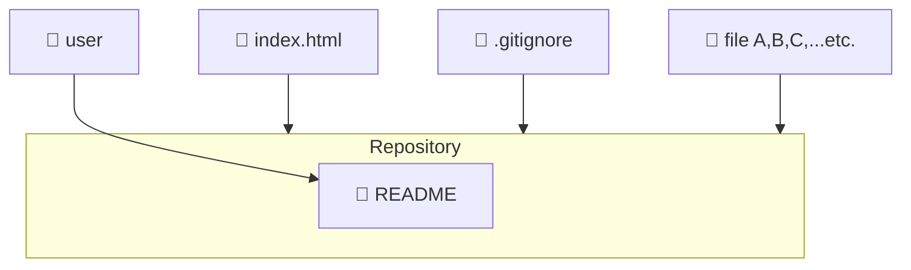

> まともな記事を執筆することは今回が初です。Zennブロガーとして精進します。

:::message
**注意**
内容の一部はサークルメンバーのみ参考になることがあります。
:::

# Git/GitHubってなんぞ
## GitHubとは
GitHubはクラウド上でプログラムコードなどのファイルデータを一元管理できるプラットフォーム（PaaS）です。  
GitHubでは、データを管理するために“リポジトリ（Repository）”という箱を作成します。  

- GitHubのイメージ図

> 上図はmermaidという記法で描いた図です。

- GitHubのホームページはコチラ

https://github.co.jp/

## Gitとは
GitはGitHubリポジトリを操作するためのツールです。基本的にコマンド操作（CLI）となります。

- GitHubのホームページはコチラ

https://git-scm.com/

# GIT(Get It Tried)
Git/GitHubを簡単に説明したところで、早速Git/GitHubに挑戦してみましょう。

## GitHubの導入
まずはGitHubアカウントを作成しましょう。GitHubのホームページにアクセスします。  
[GitHubホームページ](https://github.co.jp/)

画面右上の“Sign up”をクリックします。

特段こだわらないのであればGoogleアカウント連携に進みます。

Gmailアドレスを入力します。

Botチェックがあればチェックボックスをクリックします。

パスワードを入力します。

Gmailに届いた認証コードを入力します。

:::message
この後のサインアップ手順は割愛します。
:::

GitHubアカウントのサインアップが完了したら、今度はサインインします。

Googleアカウントを選択します。

その後はGmailアドレスやパスワード入力を進めていきます。サインインが完了するとGitHubのダッシュボードに遷移します。

これでGitHubを使用できるようになります。

## Gitのインストール
:::message
今回インストールするGitのバージョンは2.55.0.5です。
:::

GitHubアカウントの作成後はGitをインストールしていきます。[Gitのインストールページ](https://git-scm.com/install/windows)にアクセスします。

“Git for Windows/x64 Setup”をクリックしてexeファイルをダウンロードします。

ダウンロードする場所は任意のフォルダ（基本的にはダウンロードフォルダですが、今回はDドライブ直下）にします。

ダウンロードが完了したら、ブラウザからexeファイルを実行します。

実行するとウィザードが表示されます。ライセンス情報が表示されたらNextをクリックします。

コンポーネントの選択画面では、赤枠のチェックを外してください（今回は不要な機能です）。  
その後Nextをクリックします。

次の画面ではNextをクリックします（GitのデフォルトエディタはVimにします）。  
その次の画面では下のラジオボタンをチェックし、テキストボックスが“main”であることを確認します。  
その後Nextをクリックします。

:::message
ここから画面を8つ分全てNextをクリックしてください。
:::

# 参考文献

# 改訂履歴
| Ver. | 更新日 |
| --- | --- |
| 1.0 | 2026/10/05 |

以上