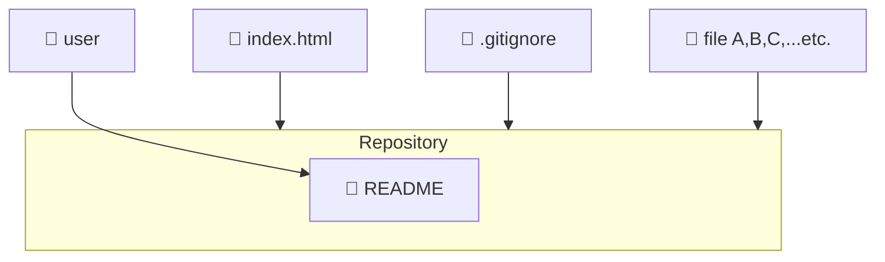

# はじめに
本記事ではGit/GitHubをとりあえず使用できるようにすることを目標に公開します。  
Git/GitHubの概念や使用方法の具体的な説明は割愛します。今後それらも執筆していく所存です。

:::message
**注意**
内容の一部はサークルメンバーのみ参考になることがあります。
:::

# Git/GitHubってなんぞ

## GitHubとは
GitHubはクラウド上でプログラムコードなどのファイルデータを一元管理できるプラットフォーム（PaaS）です。  
このロゴが目印です。

GitHubでは、データを管理するために“リポジトリ（Repository）”という箱を作成します。  

- GitHubのイメージ図

> 上図はmermaidという記法で描いた図です。

- GitHubのホームページはコチラ

https://github.co.jp/

## Gitとは
GitはGitHubリポジトリを操作するためのツールです。基本的にコマンド操作（CLI）となります。

- GitHubのホームページはコチラ

https://git-scm.com/

# Git/GitHubのセットアップ
Git/GitHubを簡単に説明したところで、早速Git/GitHubに挑戦してみましょう。  
Git/GitHubが使用できる段階までハンズオン形式で説明します。

## GitHubの導入
まずはGitHubアカウントを作成しましょう。GitHubのホームページにアクセスします。  
[GitHubホームページ](https://github.co.jp/)

画面右上の“Sign up”をクリックします。

特段こだわらないのであればGoogleアカウント連携に進みます。

Gmailアドレスを入力します。

Botチェックがあればチェックボックスをクリックします。

パスワードを入力します。

Gmailに届いた認証コードを入力します。

:::message
この後のサインアップ手順は割愛します。
:::

GitHubアカウントのサインアップが完了したら、今度はサインインします。

Googleアカウントを選択します。

その後はGmailアドレスやパスワード入力を進めていきます。サインインが完了するとGitHubのダッシュボードに遷移します。

これでGitHubを使用できるようになります。

## Gitのインストール
:::message
今回インストールするGitのバージョンは2.56.0です。
:::

GitHubアカウントの作成後はGitをインストールしていきます。[Gitのインストールページ](https://git-scm.com/install/windows)にアクセスします。

“Git for Windows/x64 Setup”をクリックしてexeファイルをダウンロードします。

ダウンロードする場所は任意のフォルダ（基本的にはダウンロードフォルダですが、今回はDドライブ直下）にします。

ダウンロードが完了したら、ブラウザからexeファイルを実行します。

実行するとウィザードが表示されます。ライセンス情報が表示されたらNextをクリックします。

インストール先はDドライブ直下を指定します。
その後Nextをクリックします。

コンポーネントの選択画面では、チェックを全て外してください。  
その後Nextをクリックします。

:::message
2つほど画面をスキップします（Nextをクリックしてください）。
:::

デフォルトのブランチ名はmainに指定します。その後Nextをクリックします。

:::message
ここから画面を8つほどスキップします（Nextをクリックしてください）。
:::

InstallをクリックしてGitのインストールを開始します。

インストールが開始されます。

インストールが完了したらFinishをクリックしてインストールを終了します（View Release Notesはチェックを外して構いません）。

これでGitを使用できるようになります。

:::message
サークルでGitを使用する場合は、PCの再起動ごとにGitを再インストールする必要があります。  
（ポータブル版Gitならその必要ないのでは？と思われるかもしれませんが、今はご容赦願います。）
:::

## 補足
上記手順をクリアしたメンバーはGitHubアカウントの初期ユーザ名を教えてください。  
私がフォローします。

# 改訂履歴
| Ver. | 更新日 |
| --- | --- |
| 1.0 | 2026/10/05 |

以上