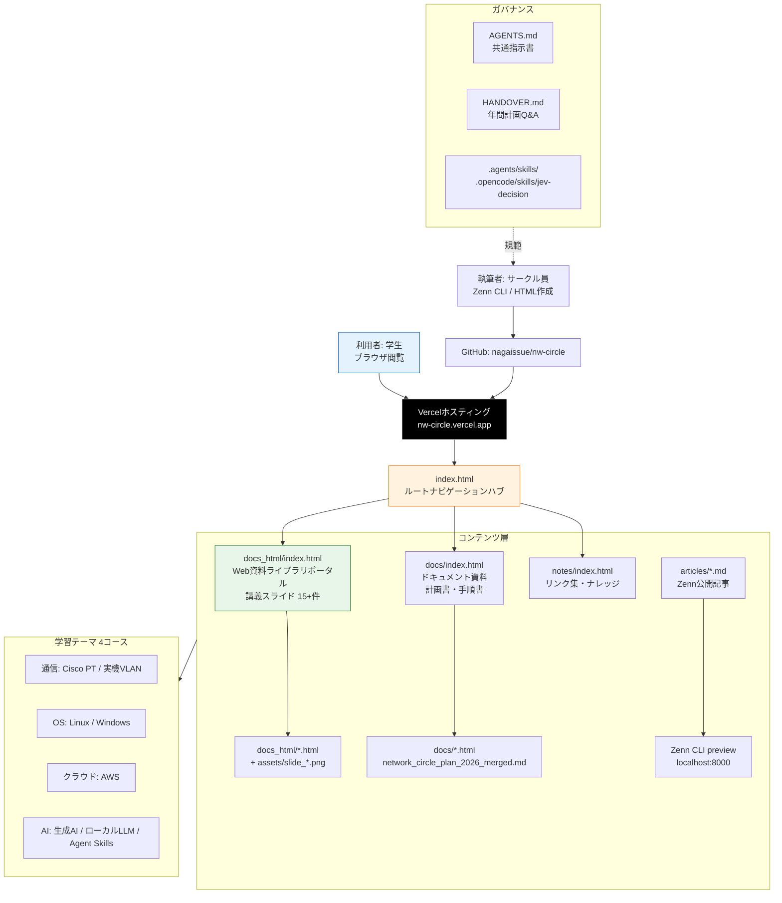

# nw-circle プロジェクト概要図

能開大ネットワークサークル「Web資料ライブラリ＆ドキュメント管理システム」の全体像。
閲覧ポータル: https://nw-circle.vercel.app/

```mermaid
flowchart TB
    User["利用者: 学生<br/>ブラウザ閲覧"] --> Vercel["Vercelホスティング<br/>nw-circle.vercel.app"]
    Author["執筆者: サークル員<br/>Zenn CLI / HTML作成"] --> GitHub["GitHub: nagaissue/nw-circle"]

    GitHub --> Vercel

    Vercel --> Hub["index.html<br/>ルートナビゲーションハブ"]

    Hub --> Slides["docs_html/index.html<br/>Web資料ライブラリポータル<br/>講義スライド 15+件"]
    Hub --> Docs["docs/index.html<br/>ドキュメント資料<br/>計画書・手順書"]
    Hub --> Notes["notes/index.html<br/>リンク集・ナレッジ"]

    subgraph Contents["コンテンツ層"]
        Slides --> SlideFiles["docs_html/*.html<br/>+ assets/slide_*.png"]
        Docs --> DocFiles["docs/*.html<br/>network_circle_plan_2026_merged.md"]
        Notes
        Articles["articles/*.md<br/>Zenn公開記事"] --> Zenn["Zenn CLI preview<br/>localhost:8000"]
    end

    subgraph Themes["学習テーマ 4コース"]
        T1["通信: Cisco PT / 実機VLAN"]
        T2["OS: Linux / Windows"]
        T3["クラウド: AWS"]
        T4["AI: 生成AI / ローカルLLM / Agent Skills"]
    end

    Contents --> Themes

    subgraph Gov["ガバナンス"]
        AGENTS["AGENTS.md<br/>共通指示書"]
        HANDOVER["HANDOVER.md<br/>年間計画Q&A"]
        Skills[".agents/skills/<br/>.opencode/skills/jev-decision"]
    end

    Gov -. 規範 .-> Author

    style User fill:#e3f2fd,stroke:#1565c0
    style Vercel fill:#000,stroke:#fff,color:#fff
    style Hub fill:#fff3e0,stroke:#ef6c00
    style Slides fill:#e8f5e9,stroke:#2e7d32
```

## 対応drawio

`project_overview.drawio` を draw.io / diagrams.net で開くと同内容を図形で確認できます。
